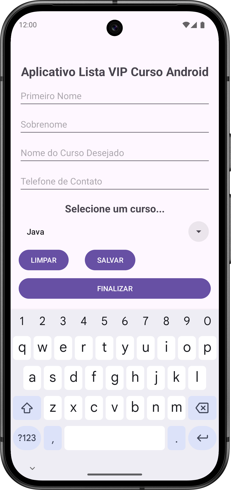

# Aplicativo Lista VIP - Curso Android

Este é o primeiro aplicativo criado durante o curso *Desenvolvimento Android em Java e Kotlin* do Marco Aurelio Dias de Oliveira na **Udemy**. O curso pode ser acessado através deste [link](https://www.udemy.com/course/desenvolvimento-android-do-absoluto-zero-para-iniciantes/).

Este aplicativo consiste em quatro inputs do tipo texto em que após serem preenchidos você poderá clicar no botão "**SALVAR**" para armazenar os dados utilizando o "*SharedPreferences*" do Android que fornece um jeito simples de armazenar pequenas quantidades de dados primitivos dos inputs em um arquivo com a extensão "*.xml*" dentro da pasta do aplicativo instalado.

O *SharedPreferences* é bastante útil para guardar preferências do usuário, configurações, ou uma pequena quantidade de dados se precisarem persistir durante as sessões do usuário.

O botão "**LIMPAR**" remove qualquer texto que foi escrito dentro dos inputs.

Ao pressionar o botão "**FINALIZAR**" encerra a Activity atual e fecha o aplicativo, exibindo, logo em seguida, um "*Toast*" com a mensagem "**Volte sempre**".

### Imagem da tela do Aplicativo:

    

