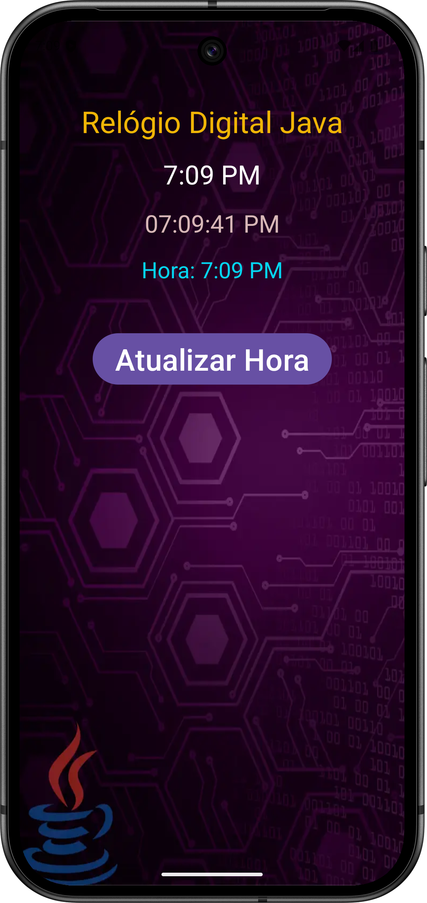

# Desenvolvimento Android em Java e Kotlin 2025

Professor Marco Maddo

[Link do curso na Udemy](https://www.udemy.com/course/desenvolvimento-android-do-absoluto-zero-para-iniciantes/)

## Relógio Digital Java

Este aplicativo feito em Java mostra a hora correta. Ao pressionar o botão "Atualizar Hora" ele copia a hora atual para uma *string* vazia. Embora o aplicativo seja bastante simples ele serve como um ponta pé inicial para um iniciante que deseja se aventurar no desenvolvimento de aplicativos para Android.

