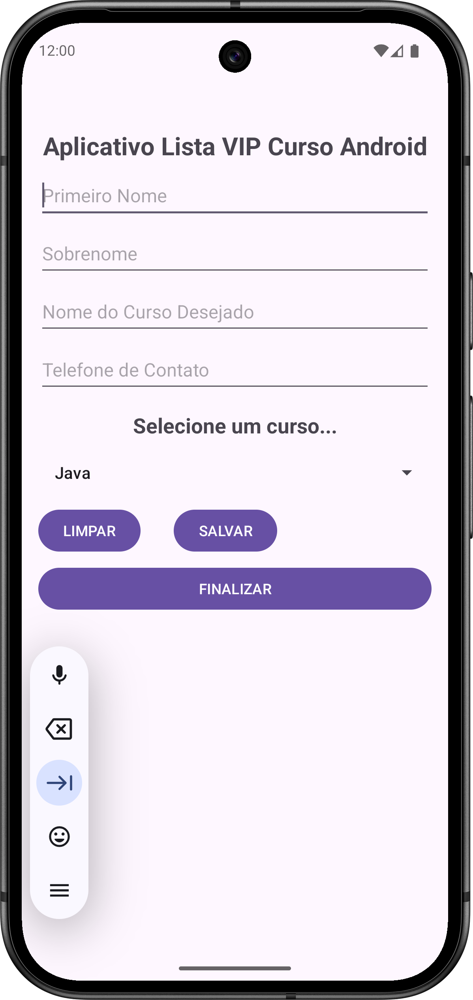

# Desenvolvimento Android em Java e Kotlin 2025

Professor Marco Maddo

[Link do curso na Udemy](https://www.udemy.com/course/desenvolvimento-android-do-absoluto-zero-para-iniciantes/)

## Relógio Digital Java

Este aplicativo feito em Java mostra a hora correta. Ao pressionar o botão "Atualizar Hora" ele copia a hora atual para uma *string* vazia. Embora o aplicativo seja bastante simples ele serve como um ponta pé inicial para um iniciante que deseja se aventurar no desenvolvimento de aplicativos para Android.

## Lista Vip

Aprendi sobre *SharedPreferences*, que é uma forma de permitir que os desenvolvedores amazenem pequenos volumes de dados primitivos em pares de chave-valor (*key-value*). É uma forma simples, leve e bastante útil para armazenar dados no dispositivo do usuário, mesmo depois que o aplicativo seja encerrado ou o dispositivo reiniciado.

Este aplicativo foi desenvolvido para armazenar informações essenciais do usuário. Ele coleta e guarda dados como o primeiro nome, o sobrenome, o curso de interesse e um telefone para contato.

Quando o usuário toca no botão de salvar, todas essas informações são gravadas em um arquivo XML localizado no diretório do próprio aplicativo. A grande vantagem é que os dados são persistentes: mesmo que você feche o aplicativo ou reinicie seu dispositivo, ao abri-lo novamente, as informações salvas anteriormente estarão lá, prontas para serem acessadas.

